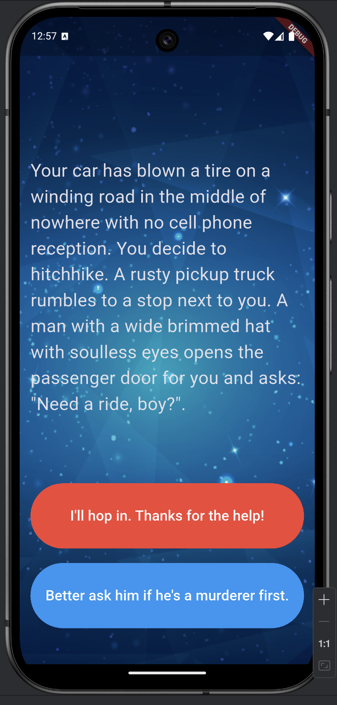
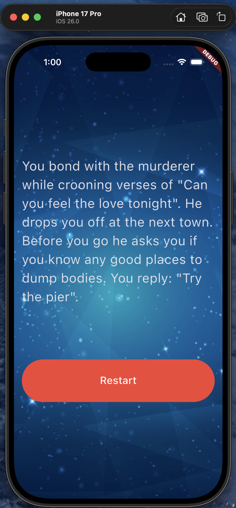

# Destini 🌠🚗🔪

**Your Fate. Your Choice.**

Welcome to **Destini**, a thrilling "Choose Your Own Adventure" application built with Flutter! 

You are driving on a winding road in the middle of nowhere when... *POP!* Your tire blows out. With no cell reception and night falling, you are faced with a series of critical decisions.

Will you hitch a ride with the stranger in the rusty pickup truck? 🧢
Will you bond over Elton John cassette tapes? 🎵
Or will you end up smashing through a guardrail? 💥

Navigate through the story, make your choices wisely, and see where your destiny leads you!

---

## 📱 Screenshots

See the adventure unfold on both platforms!

|                       **Android**                        |                     **iOS**                      |
|:--------------------------------------------------------:|:------------------------------------------------:|
|  |  |

*(Place your screenshots in a `screenshots` folder and update the paths above!)*

---

## ✨ Features

- **Interactive Story Engine**: A custom logic engine (`StoryBrain`) that manages the narrative flow based on user choices.
- **Dynamic UI**: Buttons and text update instantly as you progress through the story.
- **State Management**: seamless updates using Flutter's `setState`.
- **Visibility Control**: Smart button rendering that adapts when the story reaches an ending.

## 🛠️ Built With

- [Flutter](https://flutter.dev/) - The Google SDK for crafting beautiful UI.
- [Dart](https://dart.dev/) - The programming language behind the magic.

## 🚀 How to Run

1.  **Clone the repository**:
    ```bash
    git clone https://github.com/yourusername/destini.git
    ```
2.  **Navigate to the project directory**:
    ```bash
    cd destini
    ```
3.  **Get dependencies**:
    ```bash
    flutter pub get
    ```
4.  **Run the app**:
    ```bash
    flutter run
    ```

## 🧩 The Logic

The app uses a `StoryBrain` class to track the current story step (`_storyNumber`). Depending on whether the user selects **Choice 1** (Red) or **Choice 2** (Blue), the app navigates to the next appropriate plot point in the directed graph of the story.

---

> "Traffic accidents are the second leading cause of accidental death for most adult age groups." - *The Stranger (probably)*

**Enjoy the ride!** 🚐💨
